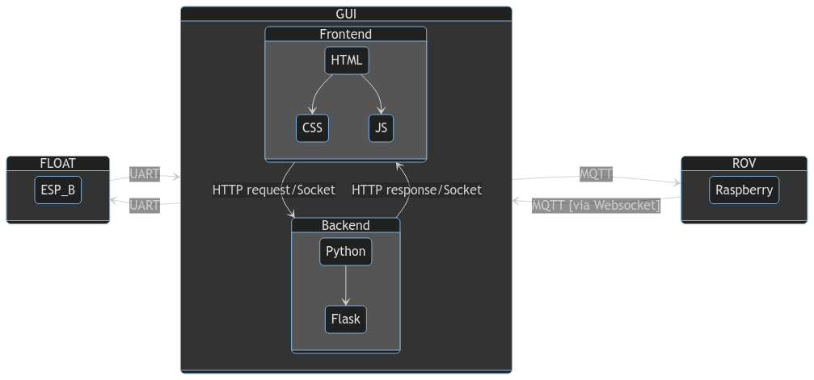

# GUI EVA
Developed as a web application using Flask in Python for backend development and HTML, JS, CSS for frontend development. 
## Installation (Linux)
You must have NodeJS and Python version 3.10
```
python3 -m venv venv
source ./venv/bin/activate
pip install -r 'requirements.txt'
cd ./static
npm install
cd ..
```
## Installation (Windows)
Good luck, Useless
## Usage
```
source ./venv/bin/activate
make test
```
## Roadmap

- [x] General Frontend
- [x] General Backend
- [x] Camera
- [x] Float
- [x] Controller
    - [x] Frontend
    - [x] Backend
    - [x] MQTT connection tests
- [x] Sensors [ Eventually ]
    - [x] Backend
    - [x] Frontend
- [x] Testing
- [x] Documentation

## PROBLEMS
* Never tested on Windows

## Documentation
The Graphical User Interface (GUI) is used by the operator to remotely control the ROV and the FLOAT.

It was developed in Python using the Flask framework, which handles HTTP requests, socket connections, MQTT communications and many utilities related to the ROV, as a cross-platform desktop web application. The frontend is built with HTML, CSS, and JavaScript.

The GUI is divided into several sections (ROV, Float, PID, etc.). The one concerning the ROV is split into two sides: on the left, there is the cameras section. On the right side, there is a designated area for displaying plots of sensor data, joystick inputs, and more.



## License
No license
